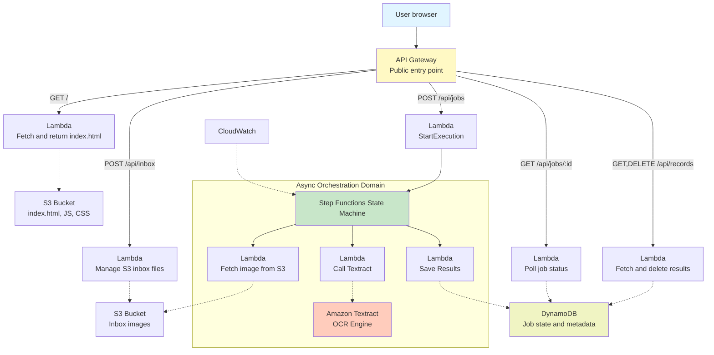

# CMSC 471 Final Project - Image-to-Text Application

A serverless, 4-tier AWS application that extracts text from images using Amazon Textract, built with Infrastructure as Code using AWS SAM.

## Project Overview

This project demonstrates a production-grade serverless architecture deployed entirely through AWS SAM templates, with BDD acceptance tests, DevOps traceability, and cost optimization strategies.

**Key Technologies:**
- AWS Lambda (compute)
- Amazon Textract (OCR)
- AWS Step Functions (orchestration)
- DynamoDB (NoSQL state)
- S3 (object storage with lifecycle policies)
- API Gateway (REST API)
- CloudWatch (monitoring)
- AWS SAM (Infrastructure as Code)

**Constraints (AWS Academy Learner Lab):**
- Uses `LabRole` only (no custom IAM roles)
- Textract instead of Bedrock (per Learner Lab allowlist)
- API Gateway instead of CloudFront for edge traffic

## Architecture



## Getting Started

```bash
# Build and deploy
sam build --use-container
sam deploy --guided --profile lab

# Run tests
pytest tests/acceptance -v
```

## Documentation

- [Architecture Details](docs/architecture.md)
- [Cost Analysis](docs/tco.md)
- [Well-Architected Review](docs/well-architected.md)